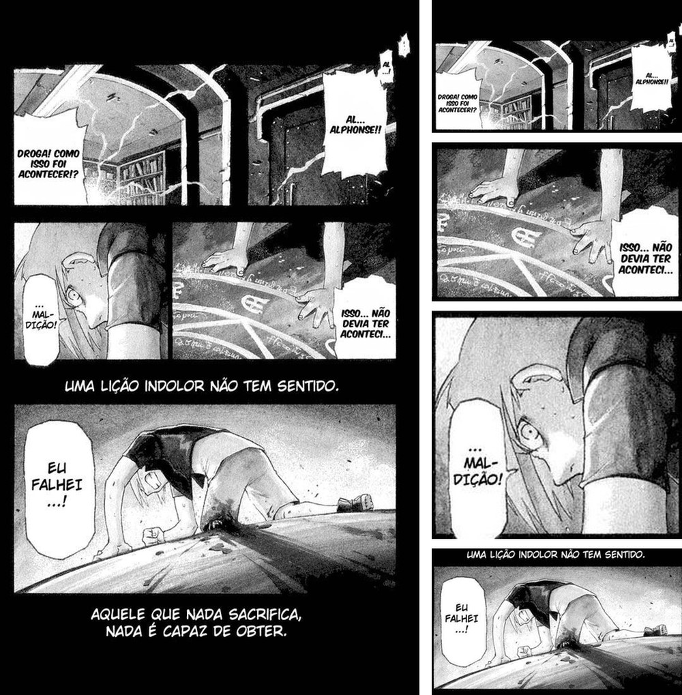
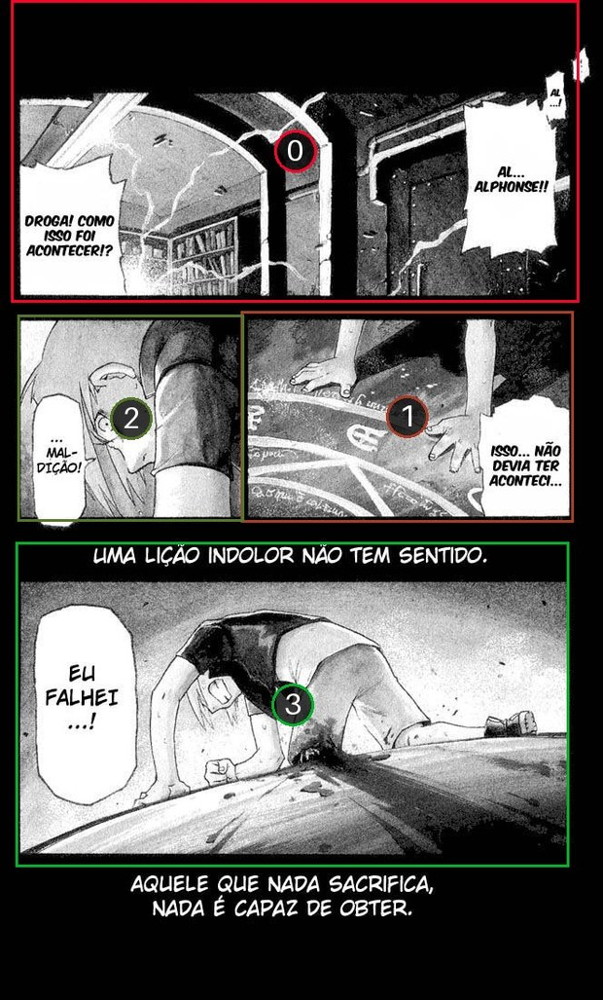
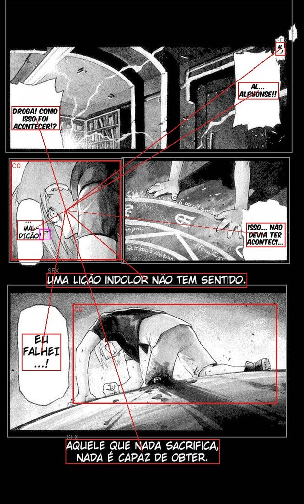
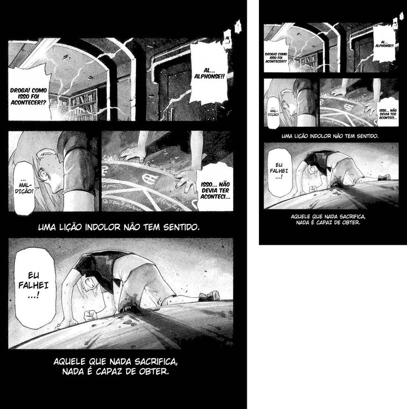

# manga-panels

**English** · [Português](README.pt-BR.md)

Cut manga pages (CBZ/CBR) into **panels** and repack them as a new CBZ — one
panel per page — so a small screen is comfortable to read on.

<p align="center">
  
</p>

- Detection by **Magi v2**, a transformer trained on manga: it handles action
  pages, bleeds and non-rectangular layouts, not just a clean grid.
- **Right-to-left** reading order (manga), taken from the model itself.
- Configure once, then just pick volumes from a menu.

It picks the best torch device on its own: **CUDA** (NVIDIA), **ROCm** (AMD),
**XPU** (Intel), **MPS** (Apple) or **CPU** (a few minutes per volume).

---

## Table of contents

- [Install](#install)
- [Quick start](#quick-start)
- [Configure (the recommended way)](#configure-the-recommended-way)
- [Device profiles](#device-profiles)
- [Check the cuts before a whole volume](#check-the-cuts-before-a-whole-volume)
- [All flags](#all-flags)
- [Output formats: CBZ, PDF, EPUB](#output-formats-cbz-pdf-epub)
- [File size: where the bytes actually are](#file-size-where-the-bytes-actually-are)
- [Screen widths](#screen-widths)
- [Kindle](#kindle)
- [Xteink X4 (EPUB-only readers)](#xteink-x4-epub-only-readers)
- [Chapters](#chapters)
- [Development](#development)
- [License](#license)

---

## Install

You need [uv](https://docs.astral.sh/uv/). Clone it and run with `uv run` — it
creates the environment and pulls the dependencies (including **torch**, ~2 GB)
on its own:

```bash
git clone https://github.com/gfrcr/manga-panels
cd manga-panels
uv run manga-panels --help
```

The Magi model (~1.5 GB) downloads automatically the first time you process
something.

> For an **AMD/Intel/Apple** GPU, install the matching torch build (ROCm/XPU/MPS)
> — the default is the NVIDIA/CUDA one. The code uses whatever is available; with
> no GPU it runs on the CPU.
>
> CBR (`.cbr`) needs the **`unrar`** binary on the system plus the extra:
> `uv sync --extra cbr`.

Prefer a bare `manga-panels` command from any folder (no `uv run` prefix)?
Install it as a uv tool:

```bash
uv tool install "git+https://github.com/gfrcr/manga-panels"
```

The examples below show `manga-panels` directly — if you went the `uv run` route,
just prefix them: `uv run manga-panels …`.

## Quick start

```bash
manga-panels chapter.cbz                # one file  -> chapter_panels.cbz
manga-panels chapter.cbz -o out.cbz     # a specific output name
manga-panels ./chapters -o ./out        # a whole folder (batch)
manga-panels page.png                   # a single loose image works too (1 page)
manga-panels                            # no input -> pick from your library menu
```

Every page becomes: the whole page first (context), then its panels in reading
order. A page the model finds one panel or fewer on — a cover, a splash, a
spread — comes out whole, once, never duplicated.

## Configure (the recommended way)

Instead of repeating flags, keep your defaults in a **`manga-panels.toml`** — in
the folder you run the command from, or at `~/.config/manga-panels/config.toml`:

```toml
[defaults]
library    = "/path/to/your/manga"   # the folder the menu opens when you run with no input
max_width  = 1264                    # your reader's width (1264 = Kindle Paperwhite)
quality    = 85
page       = "before"                # the whole page before its panels
page_scale = 0.6                     # shrink only that whole page: ~23% off the file
```

With that, run it **with no arguments** and pick what to process from a menu —
it walks into series subfolders and you select the volumes (no config? point at
the folder with `-L`/`--library`):

```bash
manga-panels -o ~/output
```

```
/path/to/your/manga
   1) [dir]  Monster
> 1
   0) ..
   1)       Monster Vol.01.cbz
   2)       Monster Vol.02.cbz
> 1,2        # numbers, ranges (1-4), 'a' for all, Enter to cancel
```

Config keys are the flag names (`max_width`, `keep_first`, …). A flag on the
command line **always wins** over the config. See
**[`manga-panels.example.toml`](manga-panels.example.toml)** for every option,
commented — copy it and adjust.

## Device profiles

`--device x4` is not just a screen width: it is the set of things **that
hardware demands**. On the X4 that means `--format epub` (it opens neither cbz
nor pdf), `--upscale` (its firmware never scales up), `--pad-aspect 3:5` (it
centres horizontally only) and `--page off` (a whole page at 480 px is
unreadable). On bigger readers a profile carries **only the width** — format and
quality there are taste, not a requirement.

To adjust a profile, add a `[device.<name>]` section to your `manga-panels.toml`:

```toml
[defaults]                 # general taste, applies everywhere
quality = 85

[device.x4]                # on top of the built-in X4 preset
quality = 80
output  = "/mnt/sd/manga"

[device.mykobo]            # a reader the tool doesn't know: becomes a --device option
max_width = 1264
grayscale = true
```

Most specific to least: **typed flag** > `[device.NAME]` > **built-in preset** >
`[defaults]` > default. `[defaults]` sits below the preset on purpose — that is
what stops an everyday `format = "pdf"` from producing a file the X4 cannot open.
When a profile is applied, the tool prints what it did.

Any name you like works — a `[device.NAME]` the tool has never heard of becomes a
valid `--device` option, and one that matches a built-in is merged over it. To see
what they all resolve to, yours included:

```bash
manga-panels --devices
```

## Check the cuts before a whole volume

`--preview` writes a CBZ with the panels drawn and numbered in reading order,
without cutting anything:

```bash
manga-panels chapter.cbz --preview
```

<p align="center">
  
</p>

Follow the numbers: **0** across the top, **1** down the tall right-hand column,
then each tier read right to left, ending at **8** on the bottom left. That is
manga order, and it comes from the model — the pipeline never re-sorts it.

To see **everything** Magi understands — panels, characters (coloured per
identity), speech bubbles coloured by who says them, and SFX marked — use
`--debug`, which writes `<stem>_debug.cbz`. It is for inspection, not reading.

<p align="center">
  
</p>

This is also why the crops look right: a cut **includes the bubble that spills
out** of its panel and the **character who is speaking**, because Magi detects
text and people, not just frames.

## All flags

All of them in `manga-panels --help`; any of them beats the config. Six have a
short form: `-o` output, `-L` library, `-f` format, `-q` quality, `-w` max-width,
`-k` keep-first.

| flag | what it does |
|---|---|
| `--devices` | list every device profile (built-in and from your config) with what it sets, and exit |
| `--preview` | `<stem>_preview.cbz` with panels drawn/numbered (check the cuts) |
| `--debug` | `<stem>_debug.cbz` with everything Magi sees (characters, bubbles, speakers) |
| `--device x4` | device profile: screen width **plus format and layout** where the hardware demands it (`x4`/`basic`/`pw11`/`paperwhite`/`sage`/`tablet`/`scribe`/`phone`) |
| `-w`, `--max-width 1264` | shrink anything wider than N px (keeps the ratio, never grows) |
| `--grayscale` | grayscale — smaller and native to e-ink |
| `--gamma 1.8` | darken midtones for e-ink (more contrast; `1.0` = off) |
| `-q`, `--quality 85` | JPEG quality, 1–95 |
| `-f`, `--format pdf\|epub\|png` | container/codec (default: JPEG inside a CBZ) |
| `--upscale` | also **grow** images up to `--max-width` (default only shrinks) |
| `--rotate-wide 1.0` | rotate a panel wider than N:1 by 90° clockwise, to read with the device turned; `0` = never |
| `--pad-aspect 3:5` | pad with white to this ratio, content centred |
| `--page before\|after\|off` | where the whole (macro) page goes — default `before` |
| `--lang en\|pt` | language of the PDF/EPUB table of contents (`Cover` / `Page N`) — default `en` |
| `--page-scale 0.6` | shrink **only the macro page** to N× the panel width (~23% off the file); `1.0` = off |
| `--split-ratio 1.0` | cut a panel wider than N:1 into vertical slices, read right to left; the whole panel comes before its slices |
| `-k`, `--keep-first N` | keep the first N pages whole (cover/front matter) |
| `--cover img.jpg` | put this image in as page 1 — the PDF/library **thumbnail** |
| `--cover-crop 0.4` | make the cover from a **wide page 1** (wraparound): a fraction of the width (with `--cover-side left/right`), or a slice, `0.385:0.72` |
| `--rtl` | right-to-left page turns in the EPUB (manga style); default is left-to-right |
| `--suffix _cut` | change the text appended to the output name (default `_panels`) |
| `--overwrite` | write back over the source file (destructive) |

## Output formats: CBZ, PDF, EPUB

The default is a **CBZ** (a zip of images) in **JPEG q90**. The other two exist
for readers that cannot open a CBZ.

**Why JPEG and not something lossless?** Because it was measured, on 973 real
panels, scoring distortion as *the share of pixels that change level once the
image is reduced to the 16 greys an e-ink screen actually shows* — below that
step, a difference is invisible on the device:

| codec | file size | pixels changed | verdict |
|---|---|---|---|
| PNG lossless | **202%** | 0% | twice the file: screentone is high-frequency noise, the worst case for PNG |
| WebP lossless | 188% | 0% | same problem |
| **JPEG q85** | **100%** | 7.0% | the default |
| WebP q85 | 88% | 7.0% | better on every count — but see below |
| JPEG 2000 1:4 | 94% | 7.6% | no real byte win, ~10× slower to decode |

WebP is the only codec that beats JPEG, and you still cannot use it in a CBZ:
**MuPDF's `cbz_ext_list` has no `.webp`**, and MuPDF is what KOReader and most
readers open comic archives with. Verified in the source, not in the docs.

### CBZ vs PDF

`--format pdf` embeds **the same JPEG bytes without re-encoding** (via
`img2pdf`), so the two weigh the same. Needs the extra: `uv sync --extra pdf`.

| | CBZ | PDF |
|---|---|---|
| size | baseline | +0.8% |
| **chapter ToC** | **none** | **yes** — an outline, via pikepdf |
| title/author | filename only | embedded in the docinfo |
| dependency | none | `uv sync --extra pdf` |
| if something breaks | it's a zip: open it, look, extract | opaque, needs tooling |
| reprocessing later | `manga-panels` reads it back | no — `unpack()` doesn't open PDF |

**The whole decision is one question: do you navigate by chapter?** If your
volumes carry `ComicInfo.xml` bookmarks, PDF is worth it — the outline is the
only navigation that survives to the device, and it costs 0.8%. If you read
straight through, CBZ, and skip the dependency.

`--format epub` is covered under [Xteink X4](#xteink-x4-epub-only-readers).
`--format png` is lossless but roughly 3× the size.

## File size: where the bytes actually are

### `--page-scale`, the biggest lever there is

The **macro page** (`--page before`) is context: it shows you the page layout,
and at a reader's width its text is already too small to read — that is what the
panels are for. But it is the most expensive image in the file. Measured on FMA
vol. 01 (973 images), macro pages are **20% of the images and 51% of the bytes**
(189 KB each, against 45 KB per panel).

`--page-scale` shrinks **only that page**, as a fraction of the panel width:

<p align="center">
  
</p>

<p align="center"><em>Left: <code>--page-scale 1.0</code> (679×1100, 190 KB).
Right: <code>0.6</code> (407×659, 82 KB) — still perfectly good at what it exists
for: layout, reading order, the weight of the page.</em></p>

| macro page treatment | volume | saved |
|---|---|---|
| `--page-scale 1.0` (default) | 3.31 MB | — |
| `--page-scale 0.8` | 2.91 MB | 12% |
| **`--page-scale 0.6`** | **2.54 MB** | **23%** |
| `--page-scale 0.5` | 2.37 MB | 28% |

*Measured end to end on 10 real pages → 43 output images, `--device paperwhite
--grayscale -q 85`.*

Shrinking beats compressing: `0.6` takes more off the file than dropping those
pages to quality 40 would, and without smearing JPEG artefacts across the page.
If the macro page does nothing for you, `--page off` removes all 51%.

It is scaled off the width the page would **actually** have — `min(--max-width,
its own width)`. A 765 px scan under `--device paperwhite` (1264) never reaches
1264, so scaling off the ceiling would shrink it by the slack instead of by the
factor you asked for.

Ignored under `--upscale` (`pack()` would grow the page straight back), and it
says so when that happens.

### The other levers

- **`--page off`** — no macro page at all: 51% of the bytes, gone.
- **`--max-width`** — match your screen, below.
- **`--grayscale`** — smaller and native to e-paper.
- **`--gamma`** — costs 2–4% in bytes and bakes the change into the pixels. If
  your reader can adjust contrast itself (KOReader can), do it there instead.

## Screen widths

`--max-width N` shrinks anything wider than N px (keeps the ratio, never grows).
Without it, the source resolution is kept. Use your device's **screen width**:

| device | screen (px) | `--max-width` |
|---|---|---|
| Xteink X4 (4.3", 220 ppi) | 800×480 | `480` |
| Kindle basic / Kobo Clara / Boox Poke (6", 300 ppi) | 1072×1448 | `1072` |
| Kindle Paperwhite 11th (6.8") | 1236×1648 | `1236` |
| Kindle Paperwhite 12th / Oasis / Colorsoft, Kobo Libra, Boox Page (7") | 1264×1680 | `1264` |
| Kobo Sage (8") | 1440×1920 | `1440` |
| Boox Note Air / reMarkable 2 / Kobo Elipsa (10.3") | 1404×1872 | `1404` |
| Kindle Scribe (10.2") | 1860×2480 | `1860` |
| Phone | ~1080–1284 | `1080` |

Approximate values (they vary by model and year). When in doubt, `1264` covers
most 6–7" readers well. Rather than memorising the number, use the profile:
`--device paperwhite` (= `--max-width 1264`), `--device scribe`, and so on.

## Kindle

**With KOReader** (jailbroken device), the Kindle reads CBZ directly — no
conversion, no Calibre, no size ceiling. Copy the file over USB:

```bash
manga-panels vol01.cbz --device paperwhite --grayscale -q 85 --page-scale 0.6
```

Leave `--gamma` off and adjust contrast on the device instead: it is the same
result without baking the loss into the file.

**On stock firmware**, the Kindle does not open CBZ — use `--format pdf`, which
fills the screen edge to edge and carries the cover and the chapter outline:

```bash
manga-panels vol01.cbz --format pdf --device paperwhite --grayscale -q 85
```

Transfer it over USB into `documents/`. Wireless Send to Kindle caps at ~50 MB,
which a volume like this passes easily.

> **EPUB on a Kindle is a dead end**, settled on a real Paperwhite: a reflowable
> book is laid out in the reader's text column, so it never fills the screen, and
> the fixed-layout shape (one image per document, KCC's approach) **freezes at 66
> documents** — a volume has thousands. `--pad-aspect 1264:1680` fixes the
> centring but not the margins. Use CBZ (KOReader) or PDF (stock).

### The cover

Page 1 is the thumbnail your library shows. `--cover cover.jpg` puts a specific
image there.

If page 1 is a **wide spread** (a wraparound jacket), it lands sideways and makes
a bad thumbnail. `--cover-crop` takes the **front cover** out of it, two ways:

```bash
--cover-crop 0.4                 # a fraction of the width, from --cover-side
--cover-crop 0.385:0.72          # a slice: from 38.5% to 72% of the width
```

The slice exists because a manga jacket is **flap + front + back**: the front
cover sits in the *middle*, where no fraction from either edge reaches. The
proportions change from volume to volume (flap and spine vary), so the number is
per file — worth checking before running the whole thing:

```bash
python -c "
import sys, zipfile, io; from PIL import Image
z = zipfile.ZipFile(sys.argv[1]); n = sorted(x for x in z.namelist() if x.endswith('.jpg'))[0]
im = Image.open(io.BytesIO(z.read(n))); w, h = im.size
a, b = (float(v) for v in sys.argv[2].split(':'))
im.crop((int(w*a), 0, int(w*b), h)).save('/tmp/cover.png')
" vol01.cbz 0.385:0.72 && xdg-open /tmp/cover.png
```

`--cover-crop 0` turns it off (useful to override a value coming from the config).

## Xteink X4 (EPUB-only readers)

The X4 (4.3", 800×480) **reads neither CBZ nor PDF** — its CrossPoint firmware
takes `.epub`, `.txt` and `.bmp`. Converting in Calibre ruins the panels: its
"comic input" resizes to the output profile and bakes the padding into the pixels.
So `--format epub` writes the file here, with no middleman.

```bash
manga-panels vol01.cbz --device x4
```

That profile is exactly this validated recipe:

```bash
manga-panels vol01.cbz --format epub --max-width 480 --upscale --grayscale -q 75 \
    --rotate-wide 1.0 --pad-aspect 3:5 --page off
```

Two quirks of the device, both read out of the firmware source:

- **It never scales up** (`if (scale > 1.0f) scale = 1.0f`). A 780 px panel
  shrinks to 480 and fills the screen — but a panel smaller than the screen sits
  there with white slack around it, and that slack is exactly what `--pad-aspect`
  is meant to fill.
- **The screen has 4 grey levels** (a 2 bits/pixel internal cache). On real pages,
  `-q 80` already gives files 27% smaller than `-q 90` with only 1.1% of pixels
  landing on a different level — invisible there. The profile uses `-q 75`, which
  showed no perceptible difference in actual use and is fewer bytes to push over
  the ESP32's WiFi.

`--rotate-wide 1.0` rotates every panel wider than 1:1, and you read it turning
the X4 anticlockwise: the long axis goes from 480 to 728 px, 2.3× the area.
`--split-ratio` (slicing a wide panel instead of rotating it) still exists, but
was tested on the device and dropped: each slice is one more page turn, and the
seam mid-scene makes reading tedious.

**`--pad-aspect` without `--upscale` does almost nothing.** Measured on 973 real
panels with `--rotate-wide 1.0 --pad-aspect 3:5 -w 480` and **no** `--upscale`:
758 of 973 came out smaller than the screen (197 px of slack at the median), and
the file ended up *bigger* than with no geometry flags at all (31.8 MB vs 28.4
MB) — just extra white, problem unsolved. With `--upscale`: 589/973 come out
exactly 480×800, 0 px of slack at the median. Always use the two together.

`--upscale` has a cost worth knowing before you wait on a transfer: small panels
get resampled up to full screen width, which fattens the JPEG. On a real volume
(FMA vol. 01, 2172 output images): 62 MB without it, 114 MB with — nearly double.
If the transfer time hurts more than it's worth, the lever is lowering `-q`
further; dropping `--upscale` is not an option, because it returns `--pad-aspect`
to the near-no-op measured above.

## Chapters

If the source CBZ has a `ComicInfo.xml` with chapter marks, they show up in the
EPUB's table of contents and the PDF's bookmarks. The field is the format's own
standard:

```xml
<Pages>
  <Page Image="5"  Bookmark="Chapter 51. Richard" />
  <Page Image="27" Bookmark="Chapter 52. The Proof" />
</Pages>
```

`Image` is the position of the image inside the archive, counted from 0 — **not**
the number printed on the page. The two usually disagree: covers and front matter
push the count, and a double-page spread stored as one image shifts everything
after it. So the tool never computes an offset; it reads `Image` as given.

Those labels — `Cover` and `Page N` — are the only text this tool writes into
the output, and `--lang` picks their language (`en` default, `pt` available).
They follow the manga, not the CLI: a Brazilian scanlation indexed as "Page 12"
is the odd one out. A new language is one line in `LABELS` (`pipeline.py`).

Without chapters, the ToC lists pages and the book is split into blocks of 20.
Nothing is invented: if the source has no chapters, the output grows none.

> **A CBZ carries no metadata.** Chapters, title and author survive only in the
> PDF and EPUB outputs — the CBZ is images and nothing else. Writing a
> `ComicInfo.xml` into it would not help on the device either: KOReader has no
> reference to it anywhere in its source.

## Development

```bash
uv sync --all-extras     # + pytest and rarfile (cbr) in the .venv
uv run pytest -q         # the real ML tests are deselected by default (-m 'not ml')
uv run pytest -m ml      # run them: downloads/loads Magi for real
```

Run through `uv run`. To hack on a `manga-panels` installed as a tool, use
`uv tool install -e . --force` (editable: only `.py` changes take effect live; a
`pyproject.toml` change needs a reinstall).

## License

The manga-panels code is **MIT** (see [LICENSE](LICENSE)) — use, modify and
distribute freely.

**Note:** detection uses the **Magi v2** model
([ragavsachdeva/magiv2](https://huggingface.co/ragavsachdeva/magiv2)), which has
its **own, non-commercial** licence (personal, research and non-profit use;
commercial use requires an agreement with the author). manga-panels does not
redistribute the model — it downloads it at runtime — but by using it you are
bound by Magi's terms.

The manga pages in the screenshots are from *Fullmetal Alchemist* (Hiromu
Arakawa) and appear here only to illustrate what the tool does.
